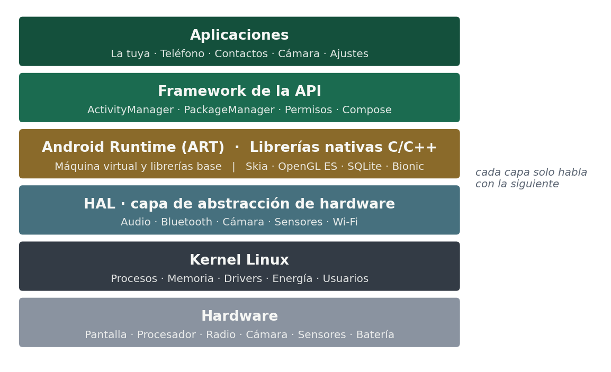
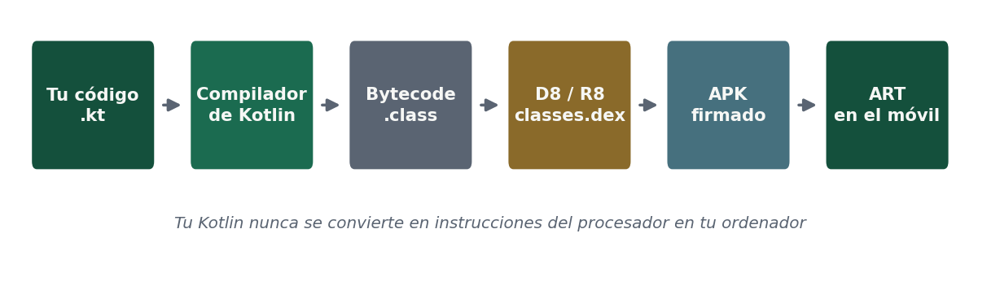

# 1.5 · Entornos de trabajo, módulos, librerías y lenguajes

## Los lenguajes

En Android conviven dos: **Java**, el original, que es en lo que está escrita la mayor parte del código que existe hoy en producción; y **Kotlin**, el recomendado desde 2019 y el que usamos en este módulo. Todo lo que aprendáis en Kotlin os sirve para leer Java, que es lo que os vais a encontrar cuando entréis en un proyecto en marcha.

## Cómo se organiza un proyecto: módulos y librerías

Un proyecto móvil se organiza en **módulos**: unidades de compilación separadas que se desarrollan y se prueban por su cuenta. Un reparto habitual distingue el módulo de aplicación, con las pantallas y la navegación; uno o varios módulos de funcionalidad, uno por área del producto; un módulo de datos, con el acceso a la base local y al servicio remoto; y un módulo común con utilidades compartidas.

Aporta tres ventajas concretas: compilaciones más rápidas porque solo se recompila lo que cambia, límites explícitos que impiden que la interfaz llame directamente a la red, y la posibilidad de reutilizar un módulo en otra aplicación.

En cuanto a **librerías**, todo proyecto móvil real se apoya en un conjunto reducido y bien conocido: una de acceso a red, una de carga de imágenes con caché, una de persistencia local, una de inyección de dependencias, una de asincronía y una de pruebas. Se eligen con el mismo criterio que cualquier dependencia: que estén mantenidas, que la licencia permita el uso previsto y que no arrastren un árbol de dependencias desproporcionado, porque en móvil cada librería suma al tamaño del paquete. Y hay que actualizarlas: en móvil las librerías se adaptan a los cambios que impone cada versión del sistema, así que una dependencia congelada acaba impidiendo publicar.

## Qué hay dentro de Android

Vuestra aplicación no habla con el hardware. Habla con la capa de arriba, y cada capa habla con la siguiente.

| Capa | Qué contiene |
|---|---|
| Aplicaciones | La vuestra, y también el teléfono, los contactos, la cámara y los ajustes: todas son aplicaciones |
| Framework de la API | Lo que llamáis desde Kotlin: `ActivityManager` decide qué aplicación vive y cuál se cierra, `PackageManager` sabe qué hay instalado, y el sistema de permisos se interpone entre vosotros y todo lo demás |
| Android Runtime (ART) | La máquina virtual donde se ejecuta vuestro código, y las librerías base del lenguaje |
| Librerías nativas | Escritas en C y C++: Skia dibuja, OpenGL ES y Vulkan pintan en la GPU, SQLite guarda, Bionic es la librería estándar de C |
| HAL | La capa de abstracción de hardware: define el «enchufe» estándar y cada fabricante pone su driver detrás |
| Kernel Linux | Procesos, memoria, drivers, energía y el modelo de usuarios |



**Android es Linux**, pero solo el kernel: encima no hay espacio de usuario GNU, así que no hay `bash` ni coreutils. Del kernel sale además el aislamiento entre aplicaciones: **cada aplicación instalada recibe su propio usuario de Linux**.

## Qué le pasa a vuestro código

Vuestro Kotlin **nunca** se convierte en instrucciones del procesador en vuestro ordenador. Se convierte en un formato intermedio, y es el aparato quien decide cuándo traducirlo.

| Paso | Qué sale |
|---|---|
| Escribís | Ficheros `.kt` |
| Compilador de Kotlin | Bytecode de la JVM (`.class`) |
| D8 / R8 | `classes.dex` — formato DEX, *Dalvik EXecutable* |
| Empaquetado | El dex entra en el APK junto a los recursos y la firma |
| En el móvil | **ART** lo interpreta, lo compila en caliente y lo optimiza con el tiempo |



Desde Android 7, ART es híbrido: instala sin compilar nada, aprende con un perfil qué partes usáis de verdad y compila solo esas en segundo plano, mientras el aparato está cargando y quieto.

Y no arranca una máquina virtual por aplicación: un proceso llamado **Zygote** carga ART y el framework una sola vez al encender, y cada aplicación nueva es un clon suyo. Por eso las aplicaciones abren en milisegundos y el framework ocupa memoria una sola vez.

### Frente a un lenguaje compilado como C

| | C compilado | Kotlin en Android |
|---|---|---|
| Salida del compilador | Instrucciones del procesador, para **una** arquitectura | DEX, para ninguna arquitectura concreta |
| Quién lo ejecuta | El kernel, directo | ART, que traduce |
| Portabilidad | Hay que recompilar por arquitectura | El mismo APK vale para ARM y para x86 |
| Memoria | La gestionáis vosotros | Recolector de basura |
| Fallo típico | Corrupción de memoria, *segfault* | Excepción, o cierre por exceder el límite de memoria |

Android también ejecuta C y C++ nativo mediante el **NDK**, que se usa en juegos, códecs de vídeo y visión artificial. Ese código sí se compila por arquitectura, y por eso dentro de un APK aparecen carpetas `lib/arm64-v8a/` y `lib/x86_64/`.

:::tip Un APK es un ZIP
Literalmente. Se renombra a `.zip`, se abre y dentro están el `classes.dex` con todo el código y, si la app lleva código nativo, la carpeta `lib/`. Os lo enseño proyectado en clase; con verlo una vez se entiende.
:::

## El entorno de trabajo

| Herramienta | Qué problema resuelve |
|---|---|
| Editor con análisis del lenguaje | Detectar errores mientras escribís |
| Vista previa de Compose (`@Preview`) | Ver la interfaz sin ejecutar, en varios tamaños y en claro y oscuro |
| Device Manager | Crear y administrar los emuladores |
| Depurador | Detener la ejecución y examinar el estado paso a paso |
| Layout Inspector | Ver cómo se anida la composición y por qué algo no aparece donde debe |
| Profiler | Medir CPU, memoria, red y batería |
| Logcat | Leer las trazas que emite la aplicación en ejecución |
| `adb` | Instalar paquetes, leer el registro, copiar ficheros y simular condiciones |
| Gradle | Gestionar dependencias, variantes del producto y la firma del paquete |

En este módulo usamos **Android Studio Quail 4 (2026.1.4) Patch 1**, la misma versión durante todo el curso y para todo el mundo. Lo tenéis en el [manual de instalación](/android/ut1/puesta-a-punto). Al crear un proyecto, la plantilla es **Empty Activity**, que es la de Compose.

## Las piezas del entorno, una a una

Vuestra aplicación no se ejecuta en el ordenador donde la programáis, sino en un móvil con otro sistema (Android) y otro procesador (ARM). A eso se le llama **desarrollo cruzado**, y explica por qué hace falta todo un entorno y no basta con un editor: las librerías de Android para compilar sin estar en Android, herramientas que conviertan el código en un paquete instalable y firmado, un puente para instalarlo y ver los errores en el aparato, y un móvil de pruebas dentro del ordenador.

### Android Studio: las ventanas que vais a usar

Es el entorno oficial de Google, gratuito y basado en IntelliJ IDEA de JetBrains, la empresa que creó Kotlin. Si alguna ventana no se ve, está en **View › Tool Windows**.

| Ventana | Para qué sirve | Cuándo la usáis |
|---|---|---|
| Editor | Escribir el código. Autocompleta y marca errores en rojo antes de compilar | Siempre |
| Project | Árbol de ficheros. Usad la vista **Android**, que los agrupa por función | Para abrir ficheros |
| Preview (vista *Split*) | Dibuja las funciones con `@Preview` sin instalar la app | Al diseñar pantallas |
| Build | Progreso y errores de la compilación | Cuando no compila |
| Logcat | Mensajes y errores de la app mientras se ejecuta | Cuando la app se cierra o hace algo raro |
| Device Manager | Crear, arrancar y borrar emuladores; ver los móviles conectados | Para probar |
| SDK Manager | Instalar versiones de Android y herramientas (**Tools › SDK Manager**) | Al configurar |
| Terminal | Línea de comandos dentro del entorno: `git`, `adb`, `gradlew` | Para comandos |

### El Android SDK por dentro

**SDK** significa *Software Development Kit*: todo lo necesario para crear aplicaciones para una plataforma desde otra. Se instala en una carpeta del ordenador y se gestiona con el SDK Manager.

| Componente | Qué contiene | Quién lo usa |
|---|---|---|
| SDK Platforms | Las clases de Android de cada versión. El proyecto compila contra la que marca `compileSdk` | Gradle, al compilar |
| SDK Build-Tools | Las herramientas de construcción: `aapt2` compila los recursos, `d8` pasa a DEX, `apksigner` firma y `zipalign` alinea el paquete | Gradle, por vosotros |
| SDK Platform-Tools | `adb`, para hablar con móviles y emuladores | Android Studio y vosotros |
| Android Emulator | El emulador y las imágenes de sistema que ejecuta cada AVD ([apartado 1.6](/android/ut1/1-6-emuladores-configuraciones-perfiles)) | Device Manager |

La ruta de esa carpeta se ve en **Settings › Languages & Frameworks › Android SDK**, y cada proyecto la guarda en el fichero `local.properties`. Como es distinta en cada ordenador, ese fichero **no se sube** al repositorio.

### JDK y Kotlin: quién compila vuestro código

El **JDK** (*Java Development Kit*) hace falta aunque programéis en Kotlin, porque **Gradle es un programa Java** y el compilador de Kotlin también se ejecuta sobre la JVM. Android Studio trae el suyo, así que no hay que instalar otro. Si Gradle se queja del JDK, se revisa en **Settings › Build, Execution, Deployment › Build Tools › Gradle › Gradle JDK**.

El JDK solo se usa en el ordenador. En el móvil no hay JVM: el código se convierte a DEX y lo ejecuta ART, como vimos más arriba.

### Gradle: por qué hace falta

Gradle es la herramienta que **construye** la aplicación, y resuelve tres problemas que tendríais sin él:

- **Dependencias.** Una app usa decenas de librerías (Compose, Material 3, Activity…), cada una con su versión. Gradle las descarga y hace que las versiones encajen; vosotros solo las nombráis en el bloque `dependencies` del `build.gradle.kts`.
- **Automatización.** Compilar Kotlin, procesar recursos, pasar a DEX, empaquetar y firmar son muchos pasos. Gradle los ejecuta en orden con un clic y solo repite lo que ha cambiado.
- **Reproducibilidad.** El **Gradle Wrapper** (`gradlew` y la carpeta `gradle/wrapper`) fija la versión de Gradle del proyecto. Por eso un repositorio se puede clonar y ejecutar igual en el ordenador de cualquier compañero.

La primera compilación tarda porque Gradle descarga su propia versión, el plugin de Android y todas las librerías. Después quedan en caché.

```bash
./gradlew assembleDebug   # genera el APK de depuración (gradlew.bat en Windows)
./gradlew clean           # borra lo compilado (la carpeta build/)
```

### adb: el puente entre el ordenador y el móvil

**adb** (*Android Debug Bridge*) es la herramienta de línea de comandos de las Platform-Tools que comunica el ordenador con un móvil o un emulador. Android Studio la usa todo el rato: cada vez que pulsáis Run instala la app con adb, y Logcat recibe los mensajes a través de adb.

| Pieza | Dónde está | Qué hace |
|---|---|---|
| Cliente | En vuestro ordenador | Donde dais la orden: la Terminal o el propio Android Studio |
| Servidor adb | En vuestro ordenador | Recibe las órdenes y las reparte entre los dispositivos conectados (puerto 5037) |
| `adbd` | En el móvil o el emulador | Ejecuta las órdenes dentro del aparato. Habla con el ordenador por USB o por Wi-Fi |

| Comando | Para qué |
|---|---|
| `adb devices` | Lista los móviles y emuladores conectados |
| `adb install app-debug.apk` | Instala un APK |
| `adb uninstall <applicationId>` | Desinstala una app |
| `adb logcat` | Muestra en directo los mensajes del aparato |
| `adb shell` | Abre una consola dentro del aparato |
| `adb push` / `adb pull` | Copia ficheros al móvil o desde él |

Por seguridad, un móvil real solo acepta órdenes de un ordenador que el usuario haya **autorizado**: si no, cualquiera que lo enchufara podría instalar aplicaciones o leer datos. Si la Terminal dice que no reconoce `adb`, es que la carpeta `platform-tools` del SDK no está en el `PATH`: se puede ejecutar con su ruta completa.

