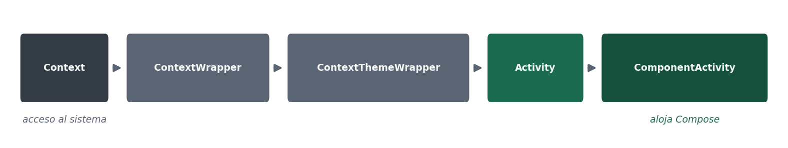

# 2.1 · Estructura de una aplicación móvil y jerarquía de clases

El currículo pide analizar la estructura de una aplicación existente **identificando las clases utilizadas**. Este apartado es el vocabulario con el que vais a poder hacerlo, y es también la puerta de entrada a la UT2.

## Qué hay en un proyecto

| Elemento | Qué es |
|---|---|
| `AndroidManifest.xml` | El descriptor: declara los componentes de la aplicación, los permisos que pide y el hardware que necesita. Es lo primero que se mira al abrir un proyecto ajeno |
| `MainActivity.kt` | El punto de entrada: la clase que el sistema instancia cuando el usuario abre la aplicación |
| Funciones `@Composable` | La interfaz, escrita en Kotlin. Cada una describe un trozo de pantalla en función del estado |
| `res/` | Los recursos: textos, colores, iconos, dimensiones. Separados del código para poder traducir y adaptar sin tocarlo |
| `build.gradle.kts` | Las dependencias, las variantes y los tres números del [apartado 1.6](/android/ut1/1-6-emuladores-configuraciones-perfiles) |

### El proyecto en el panel Project

Así se ve un proyecto recién creado con la plantilla **Empty Activity**, en la vista *Android* del panel Project:

```text
app/
  manifests/AndroidManifest.xml     → el descriptor
  kotlin+java/es.iesvillaverde…/
      MainActivity.kt                → el punto de entrada
      ui/theme/                      → colores, tipografía y tema
  res/                               → drawable, mipmap, values (strings.xml)
Gradle Scripts/
  build.gradle.kts (Project)         → plugins comunes
  build.gradle.kts (Module :app)     → applicationId, minSdk, targetSdk, dependencias
  settings.gradle.kts                → módulos y repositorios
  libs.versions.toml                 → versiones de las librerías
```

Hay dos `build.gradle.kts`: el que manda sobre vuestra aplicación es el del **Module :app**.


## Los cuatro componentes de una aplicación

Android define cuatro tipos de componente, y cada uno se declara en el manifiesto:

| Componente | Para qué sirve |
|---|---|
| **Activity** | Una pantalla con la que el usuario interactúa |
| **Service** | Trabajo sin interfaz, por ejemplo reproducir audio en segundo plano |
| **BroadcastReceiver** | Reacciona a avisos del sistema: se ha conectado el cargador, ha llegado un mensaje |
| **ContentProvider** | Expone datos de la aplicación a otras aplicaciones de forma controlada |

En una aplicación moderna hecha con Compose lo habitual es tener **una sola `Activity`**, y que las pantallas sean funciones `@Composable` dentro de ella.

## La jerarquía de clases

Esta es la cadena que hay que saber leer, porque explica por qué una `Activity` puede hacer casi todo lo que hace:

```text
Context → ContextWrapper → ContextThemeWrapper → Activity → ComponentActivity
```



- **`Context`** es el acceso al sistema: recursos, preferencias, arranque de otros componentes, permisos. Casi todas las llamadas al framework piden un `Context`.
- **`Activity`** es un `Context` que además tiene ciclo de vida y pantalla.
- **`ComponentActivity`** es de la que heredan las actividades modernas, y es la que sabe alojar contenido de Compose mediante `setContent`.

Junto a ellas aparecen otras dos clases que veréis en cualquier proyecto actual:

- **`Application`**, una única instancia que vive mientras vive el proceso. Se usa para la inicialización global.
- **`ViewModel`**, que guarda el estado que la pantalla necesita y **sobrevive a la rotación**. Es la respuesta al problema del apartado siguiente.

:::tip Cómo analizar un proyecto ajeno
Abrid el `AndroidManifest.xml` y mirad qué componentes declara y qué permisos pide: en dos minutos sabéis qué hace la aplicación. Después localizad la `Activity` de entrada, y desde ella seguid el hilo hasta los composables y hasta de dónde salen los datos.
:::
