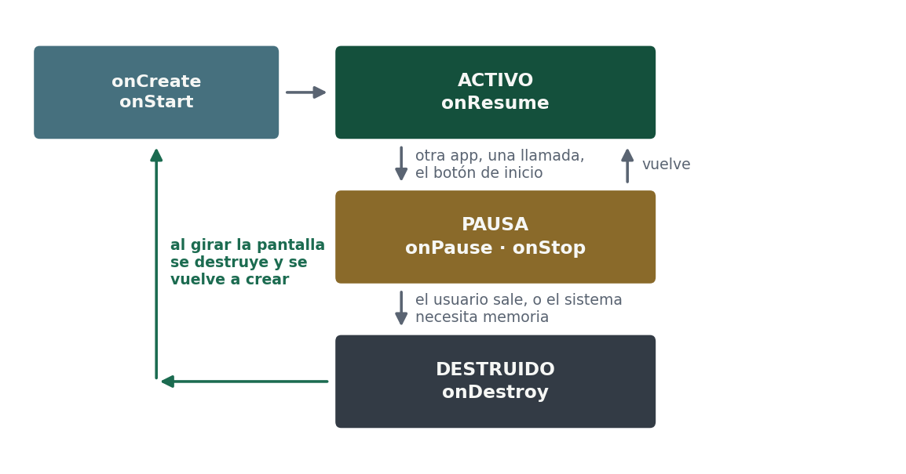

# 2.2 · Modelo de estados: activo, pausa y destruido

El currículo nombra tres estados, y conviene usar esas palabras porque son las suyas:

| Estado | Qué significa | Qué tenéis que hacer |
|---|---|---|
| **Activo** | La aplicación está en primer plano y el usuario interactúa con ella | Nada especial: es la situación normal |
| **Pausa** | Ha perdido el foco o ha pasado a segundo plano: otra aplicación, una llamada, el botón de inicio | Guardar lo que no podáis perder y soltar lo que consume: cámara, sensores, reproducción |
| **Destruido** | El sistema la ha eliminado de memoria, por decisión del usuario o para liberar recursos | Ya no hay nada que hacer: lo que no guardasteis, se perdió |

En Android esos estados se manifiestan como métodos que el sistema llama:

| Momento | Secuencia de métodos |
|---|---|
| Arrancar la aplicación | `onCreate` → `onStart` → `onResume` |
| Pulsar Inicio y volver | `onPause` → `onStop` … `onStart` → `onResume` |
| Rotar la pantalla | `onPause` → `onStop` → `onDestroy` → `onCreate` → `onStart` → `onResume` |
| Pulsar Atrás | `onPause` → `onStop` → `onDestroy` |



La regla que hay que fijar: **vuestra aplicación no manda sobre su propio ciclo**. El sistema puede pausarla, pararla o eliminarla de memoria en cualquier momento. Vuestro trabajo es guardar el estado cuando os avisan y restaurarlo al volver.

Fijaos especialmente en la tercera fila. Al girar el aparato, la pantalla se destruye y se vuelve a crear entera: todo lo que el usuario hubiera escrito y no hayáis guardado, desaparece. En iOS existe el mismo concepto con otros nombres —`viewDidLoad`, `viewWillAppear`, `viewDidAppear`—, con la diferencia de que allí la rotación no destruye la pantalla.

:::warning Un error frecuente
Se suele pensar que una aplicación, una vez abierta, se ejecuta siempre igual y sin interrupciones. En realidad puede pausarse o cerrarse en cualquier momento: una llamada entrante, falta de memoria, el usuario que cambia de aplicación. Ignorarlo causa pérdida de datos, y es la causa número uno de fallos en una aplicación de prácticas.
:::

## Verlo con vuestros ojos: el modelo de estados en Logcat

El modelo de estados no hay que creérselo: se puede ver. Basta con que cada método escriba una línea en el registro con `Log.d`, y mirar Logcat mientras se usa la aplicación.

```kotlin
import android.util.Log

class MainActivity : ComponentActivity() {
    override fun onCreate(savedInstanceState: Bundle?) {
        super.onCreate(savedInstanceState)
        Log.d("Estados", "onCreate")
        // … el resto de onCreate, tal como lo trae la plantilla
    }
    override fun onStart() { super.onStart(); Log.d("Estados", "onStart") }
    override fun onResume() { super.onResume(); Log.d("Estados", "onResume") }
    override fun onPause() { super.onPause(); Log.d("Estados", "onPause") }
    override fun onStop() { super.onStop(); Log.d("Estados", "onStop") }
    override fun onDestroy() { super.onDestroy(); Log.d("Estados", "onDestroy") }
}
```

En Logcat escribid `tag:Estados` en el filtro para ver solo esas líneas. Después arrancad la app, pulsad Inicio y volved, girad el emulador y pulsad Atrás, y comparad lo que sale con la tabla de arriba. Si al girar no cambia nada, activad **Girar automáticamente** en los ajustes rápidos del emulador.

