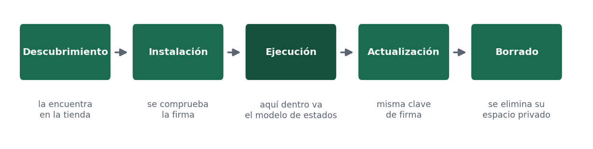

# 2.3 · Ciclo de vida de la aplicación

Distinto del anterior: el modelo de estados es lo que pasa **mientras se ejecuta**; el ciclo de vida es lo que le pasa a la aplicación **en el aparato**, desde que el usuario la conoce hasta que la borra.

| Fase | Qué ocurre |
|---|---|
| **Descubrimiento** | El usuario encuentra la aplicación, casi siempre en una tienda |
| **Instalación** | La descarga, se comprueba la firma y se le asigna su identidad y su espacio privado |
| **Ejecución** | La usa. Aquí dentro ocurre el modelo de estados del apartado anterior |
| **Actualización** | Recibe versiones nuevas, firmadas con la misma clave, que deben mantener la compatibilidad con los datos anteriores |
| **Borrado** | Se desinstala y el sistema elimina su espacio privado |

Dos consecuencias prácticas. La primera: conviven varias versiones de vuestra aplicación funcionando a la vez contra el mismo servidor, porque no todo el mundo actualiza a la vez, así que la interfaz de los servicios debe ser compatible hacia atrás. La segunda: al desinstalar se borra todo lo local, de modo que si hay datos que el usuario debe conservar tienen que estar en el servidor o poder exportarse —algo que además reconoce la normativa de protección de datos.

## El administrador de aplicaciones

El sistema operativo es quien gobierna todo lo anterior: instala, arranca, suspende, actualiza y desinstala, y a cada aplicación le impone su modelo de permisos y de recursos.

- **Controla los recursos.** Puede cerrar aplicaciones en segundo plano para liberar memoria.
- **Aísla cada aplicación** en su espacio privado, con su propia identidad.
- **Concede y revoca permisos** en tiempo de ejecución.
- **Restringe la ejecución en segundo plano.** Las tareas largas se declaran como trabajo planificado y el sistema decide cuándo ejecutarlas.
