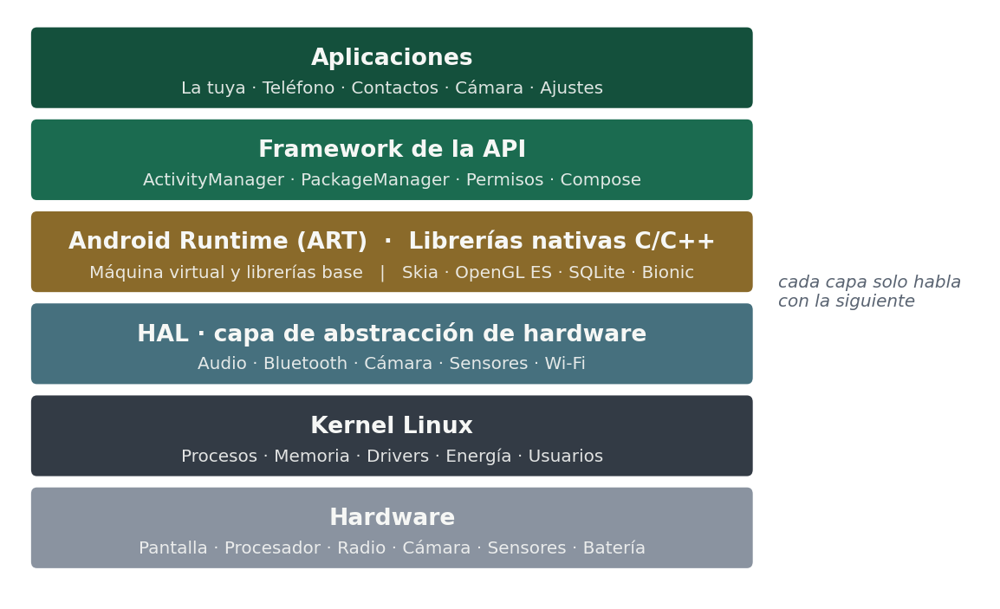
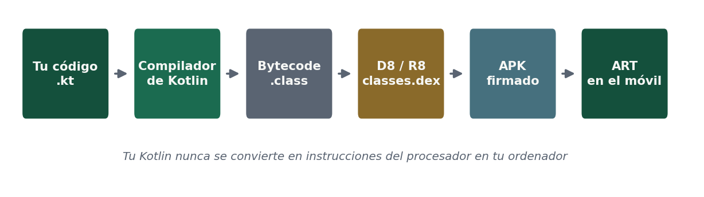

# Qué hay dentro de Android

Vuestra aplicación no habla con el hardware. Habla con la capa de arriba, y cada capa habla con la siguiente.

| Capa | Qué contiene |
|---|---|
| Aplicaciones | La vuestra, y también el teléfono, los contactos, la cámara y los ajustes: todas son aplicaciones |
| Framework de la API | Lo que llamáis desde Kotlin: `ActivityManager` decide qué aplicación vive y cuál se cierra, `PackageManager` sabe qué hay instalado, y el sistema de permisos se interpone entre vosotros y todo lo demás |
| Android Runtime (ART) | La máquina virtual donde se ejecuta vuestro código, y las librerías base del lenguaje |
| Librerías nativas | Escritas en C y C++: Skia dibuja, OpenGL ES y Vulkan pintan en la GPU, SQLite guarda, Bionic es la librería estándar de C |
| HAL | La capa de abstracción de hardware: define el «enchufe» estándar y cada fabricante pone su driver detrás |
| Kernel Linux | Procesos, memoria, drivers, energía y el modelo de usuarios |

**Android es Linux**, pero solo el kernel: encima no hay espacio de usuario GNU, así que no hay `bash` ni coreutils. Del kernel sale además el aislamiento entre aplicaciones: **cada aplicación instalada recibe su propio usuario de Linux**.

## Qué le pasa a vuestro código

Vuestro Kotlin **nunca** se convierte en instrucciones del procesador en vuestro ordenador. Se convierte en un formato intermedio, y es el aparato quien decide cuándo traducirlo.

| Paso | Qué sale |
|---|---|
| Escribís | Ficheros `.kt` |
| Compilador de Kotlin | Bytecode de la JVM (`.class`) |
| D8 / R8 | `classes.dex` — formato DEX, *Dalvik EXecutable* |
| Empaquetado | El dex entra en el APK junto a los recursos y la firma |
| En el móvil | **ART** lo interpreta, lo compila en caliente y lo optimiza con el tiempo |

Desde Android 7, ART es híbrido: instala sin compilar nada, aprende con un perfil qué partes usáis de verdad y compila solo esas en segundo plano, mientras el aparato está cargando y quieto.

Y no arranca una máquina virtual por aplicación: un proceso llamado **Zygote** carga ART y el framework una sola vez al encender, y cada aplicación nueva es un clon suyo. Por eso las aplicaciones abren en milisegundos y el framework ocupa memoria una sola vez.

### Frente a un lenguaje compilado como C

| | C compilado | Kotlin en Android |
|---|---|---|
| Salida del compilador | Instrucciones del procesador, para **una** arquitectura | DEX, para ninguna arquitectura concreta |
| Quién lo ejecuta | El kernel, directo | ART, que traduce |
| Portabilidad | Hay que recompilar por arquitectura | El mismo APK vale para ARM y para x86 |
| Memoria | La gestionáis vosotros | Recolector de basura |
| Fallo típico | Corrupción de memoria, *segfault* | Excepción, o cierre por exceder el límite de memoria |

Android también ejecuta C y C++ nativo mediante el **NDK**, que se usa en juegos, códecs de vídeo y visión artificial. Ese código sí se compila por arquitectura, y por eso dentro de un APK aparecen carpetas `lib/arm64-v8a/` y `lib/x86_64/`.

:::tip Un APK es un ZIP
Literalmente. Se renombra a `.zip`, se abre y dentro están el `classes.dex` con todo el código y, si la app lleva código nativo, la carpeta `lib/`. Os lo enseño proyectado en clase; con verlo una vez se entiende.
:::

## El entorno de trabajo

| Herramienta | Qué problema resuelve |
|---|---|
| Editor con análisis del lenguaje | Detectar errores mientras escribís |
| Vista previa de Compose (`@Preview`) | Ver la interfaz sin ejecutar, en varios tamaños y en claro y oscuro |
| Device Manager | Crear y administrar los emuladores |
| Depurador | Detener la ejecución y examinar el estado paso a paso |
| Layout Inspector | Ver cómo se anida la composición y por qué algo no aparece donde debe |
| Profiler | Medir CPU, memoria, red y batería |
| Logcat | Leer las trazas que emite la aplicación en ejecución |
| `adb` | Instalar paquetes, leer el registro, copiar ficheros y simular condiciones |
| Gradle | Gestionar dependencias, variantes del producto y la firma del paquete |

En este módulo usamos **Android Studio Quail 4 (2026.1.4) Patch 1**, la misma versión durante todo el curso y para todo el mundo. Lo tenéis en el [manual de instalación](/android/ut1/puesta-a-punto).

## Cómo se organiza un proyecto

Un proyecto móvil se organiza en **módulos**: unidades de compilación separadas que se desarrollan y se prueban por su cuenta. Un reparto habitual distingue el módulo de aplicación, con las pantallas y la navegación; uno o varios módulos de funcionalidad, uno por área del producto; un módulo de datos, con el acceso a la base local y al servicio remoto; y un módulo común con utilidades compartidas.

Aporta tres ventajas concretas: compilaciones más rápidas porque solo se recompila lo que cambia, límites explícitos que impiden que la interfaz llame directamente a la red, y la posibilidad de reutilizar un módulo en otra aplicación.

En cuanto a **librerías**, todo proyecto móvil real se apoya en un conjunto reducido y bien conocido: una de acceso a red, una de carga de imágenes con caché, una de persistencia local, una de inyección de dependencias, una de asincronía y una de pruebas. Se eligen con el mismo criterio que cualquier dependencia: que estén mantenidas, que la licencia permita el uso previsto y que no arrastren un árbol de dependencias desproporcionado, porque en móvil cada librería suma al tamaño del paquete. Y hay que actualizarlas: en móvil las librerías se adaptan a los cambios que impone cada versión del sistema, así que una dependencia congelada acaba impidiendo publicar.
