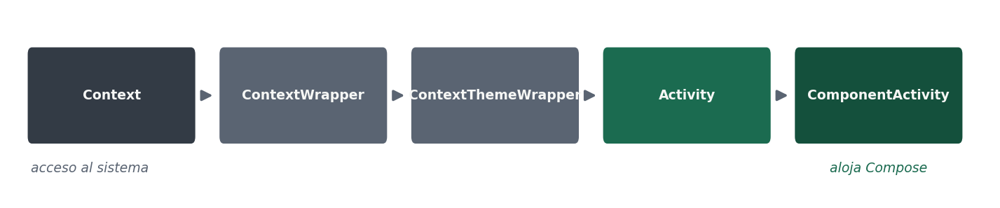
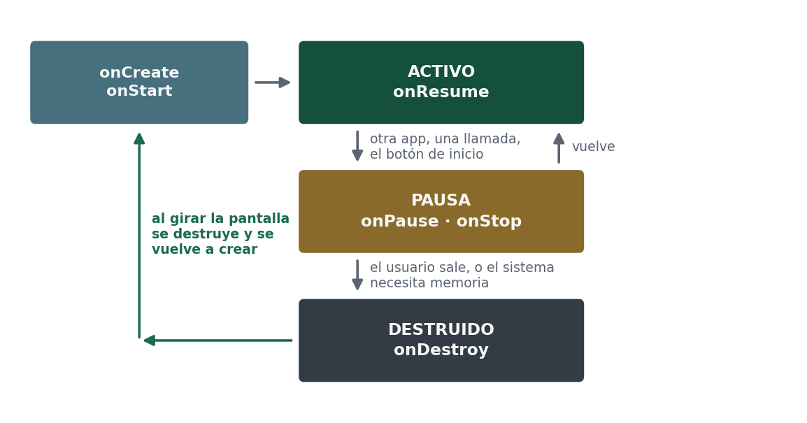
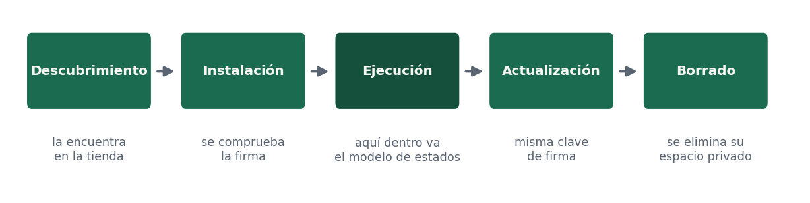

# Estructura de una app, estados y ciclo de vida

Este apartado es el vocabulario con el que vais a poder analizar una aplicación ajena, y es también la puerta de entrada a la UT2.

## Qué hay en un proyecto

| Elemento | Qué es |
|---|---|
| `AndroidManifest.xml` | El descriptor: declara los componentes de la aplicación, los permisos que pide y el hardware que necesita. Es lo primero que se mira al abrir un proyecto ajeno |
| `MainActivity.kt` | El punto de entrada: la clase que el sistema instancia cuando el usuario abre la aplicación |
| Funciones `@Composable` | La interfaz, escrita en Kotlin. Cada una describe un trozo de pantalla en función del estado |
| `res/` | Los recursos: textos, colores, iconos, dimensiones. Separados del código para poder traducir y adaptar sin tocarlo |
| `build.gradle.kts` | Las dependencias, las variantes y los tres números de la página anterior |

## Los cuatro componentes de una aplicación

Android define cuatro tipos de componente, y cada uno se declara en el manifiesto:

| Componente | Para qué sirve |
|---|---|
| **Activity** | Una pantalla con la que el usuario interactúa |
| **Service** | Trabajo sin interfaz, por ejemplo reproducir audio en segundo plano |
| **BroadcastReceiver** | Reacciona a avisos del sistema: se ha conectado el cargador, ha llegado un mensaje |
| **ContentProvider** | Expone datos de la aplicación a otras aplicaciones de forma controlada |

En una aplicación moderna hecha con Compose lo habitual es tener **una sola `Activity`**, y que las pantallas sean funciones `@Composable` dentro de ella.

## La jerarquía de clases

Esta es la cadena que hay que saber leer, porque explica por qué una `Activity` puede hacer casi todo lo que hace:

```text
Context → ContextWrapper → ContextThemeWrapper → Activity → ComponentActivity
```



- **`Context`** es el acceso al sistema: recursos, preferencias, arranque de otros componentes, permisos. Casi todas las llamadas al framework piden un `Context`.
- **`Activity`** es un `Context` que además tiene ciclo de vida y pantalla.
- **`ComponentActivity`** es de la que heredan las actividades modernas, y es la que sabe alojar contenido de Compose mediante `setContent`.

Junto a ellas aparecen otras dos clases que veréis en cualquier proyecto actual:

- **`Application`**, una única instancia que vive mientras vive el proceso. Se usa para la inicialización global.
- **`ViewModel`**, que guarda el estado que la pantalla necesita y **sobrevive a la rotación**. Es la respuesta al problema del apartado siguiente.

:::tip Cómo analizar un proyecto ajeno
Abrid el `AndroidManifest.xml` y mirad qué componentes declara y qué permisos pide: en dos minutos sabéis qué hace la aplicación. Después localizad la `Activity` de entrada, y desde ella seguid el hilo hasta los composables y hasta de dónde salen los datos.
:::

## Modelo de estados: activo, pausa y destruido

| Estado | Qué significa | Qué tenéis que hacer |
|---|---|---|
| **Activo** | La aplicación está en primer plano y el usuario interactúa con ella | Nada especial: es la situación normal |
| **Pausa** | Ha perdido el foco o ha pasado a segundo plano: otra aplicación, una llamada, el botón de inicio | Guardar lo que no podáis perder y soltar lo que consume: cámara, sensores, reproducción |
| **Destruido** | El sistema la ha eliminado de memoria, por decisión del usuario o para liberar recursos | Ya no hay nada que hacer: lo que no guardasteis, se perdió |

En Android esos estados se manifiestan como métodos que el sistema llama:

| Momento | Secuencia de métodos |
|---|---|
| Arrancar la aplicación | `onCreate` → `onStart` → `onResume` |
| Pulsar Inicio y volver | `onPause` → `onStop` … `onStart` → `onResume` |
| Rotar la pantalla | `onPause` → `onStop` → `onDestroy` → `onCreate` → `onStart` → `onResume` |
| Pulsar Atrás | `onPause` → `onStop` → `onDestroy` |



La regla que hay que fijar: **vuestra aplicación no manda sobre su propio ciclo**. El sistema puede pausarla, pararla o eliminarla de memoria en cualquier momento. Vuestro trabajo es guardar el estado cuando os avisan y restaurarlo al volver.

Fijaos especialmente en la tercera fila. Al girar el aparato, la pantalla se destruye y se vuelve a crear entera: todo lo que el usuario hubiera escrito y no hayáis guardado, desaparece. En iOS existe el mismo concepto con otros nombres —`viewDidLoad`, `viewWillAppear`, `viewDidAppear`—, con la diferencia de que allí la rotación no destruye la pantalla.

:::warning Un error frecuente
Se suele pensar que una aplicación, una vez abierta, se ejecuta siempre igual y sin interrupciones. En realidad puede pausarse o cerrarse en cualquier momento: una llamada entrante, falta de memoria, el usuario que cambia de aplicación. Ignorarlo causa pérdida de datos, y es la causa número uno de fallos en una aplicación de prácticas.
:::

## Ciclo de vida de la aplicación

Distinto del anterior: el modelo de estados es lo que pasa **mientras se ejecuta**; el ciclo de vida es lo que le pasa a la aplicación **en el aparato**, desde que el usuario la conoce hasta que la borra.

| Fase | Qué ocurre |
|---|---|
| **Descubrimiento** | El usuario encuentra la aplicación, casi siempre en una tienda |
| **Instalación** | La descarga, se comprueba la firma y se le asigna su identidad y su espacio privado |
| **Ejecución** | La usa. Aquí dentro ocurre el modelo de estados del apartado anterior |
| **Actualización** | Recibe versiones nuevas, firmadas con la misma clave, que deben mantener la compatibilidad con los datos anteriores |
| **Borrado** | Se desinstala y el sistema elimina su espacio privado |



Dos consecuencias prácticas. La primera: conviven varias versiones de vuestra aplicación funcionando a la vez contra el mismo servidor, porque no todo el mundo actualiza a la vez, así que la interfaz de los servicios debe ser compatible hacia atrás. La segunda: al desinstalar se borra todo lo local, de modo que si hay datos que el usuario debe conservar tienen que estar en el servidor o poder exportarse —algo que además reconoce la normativa de protección de datos.

### El administrador de aplicaciones

El sistema operativo es quien gobierna todo lo anterior: instala, arranca, suspende, actualiza y desinstala, y a cada aplicación le impone su modelo de permisos y de recursos.

- **Controla los recursos.** Puede cerrar aplicaciones en segundo plano para liberar memoria.
- **Aísla cada aplicación** en su espacio privado, con su propia identidad.
- **Concede y revoca permisos** en tiempo de ejecución.
- **Restringe la ejecución en segundo plano.** Las tareas largas se declaran como trabajo planificado y el sistema decide cuándo ejecutarlas.

## Modificar una aplicación que ya existe

Es lo que haréis con más frecuencia en vuestros primeros años: casi nadie empieza un proyecto desde cero, casi todos entran en uno en marcha. El método tiene un orden que ahorra semanas:

1. **Compilar y ejecutar antes de tocar nada.** Si el proyecto no arranca tal cual, lo primero es dejarlo funcionando: versiones de las herramientas, dependencias, claves de firma y configuración del entorno. Ahí se pierden los primeros días.
2. **Recorrer la aplicación como usuario**, anotando pantallas y flujos. El mapa mental se construye desde fuera, no leyendo código.
3. **Leer el manifiesto y localizar el punto de entrada**: qué componentes declara, qué permisos pide, qué `Activity` abre.
4. **Identificar la arquitectura**, aunque sea imperfecta: dónde está la interfaz, dónde la lógica, dónde el acceso a datos y a la red.
5. **Cambiar lo mínimo y comprobar.** Un cambio pequeño, ejecutado y verificado, enseña más sobre el proyecto que una tarde de lectura.

Los encargos que llegan en la práctica son de cuatro tipos, con dificultad creciente:

| Tipo | Qué implica |
|---|---|
| Cambios de apariencia: textos, colores, iconos, traducciones | Los más seguros |
| Añadir una pantalla o un campo | Exige entender la navegación y el modelo de datos |
| Integrar un servicio remoto nuevo | Toca la capa de red y los permisos |
| Subir la aplicación a una versión nueva del sistema | El más ingrato, y el único obligatorio y periódico |

## Los diez errores que más se repiten al empezar

Pasadla como comprobación antes de dar por terminada cualquier entrega del módulo.

1. Operaciones lentas en el hilo principal → la aplicación se congela y el sistema ofrece cerrarla.
2. Cargar imágenes a tamaño completo → cierre por falta de memoria.
3. No contemplar la rotación → se pierde lo que el usuario había escrito.
4. Suponer que hay conexión → excepción no controlada en cuanto se entra en un ascensor.
5. Pedir todos los permisos al arrancar → el usuario los deniega y la aplicación no funciona.
6. No comprobar el permiso antes de cada uso → fallo cuando el usuario lo revoca.
7. Probar en un solo dispositivo → fallos en producción en versiones y tamaños no probados.
8. Dejar credenciales o claves en el código → aparecen en cuanto alguien descompila el paquete.
9. No liberar recursos —reproductores, cámara, sensores, *listeners*— al pasar a segundo plano.
10. Olvidar la clave de firma → imposibilidad definitiva de publicar actualizaciones.
